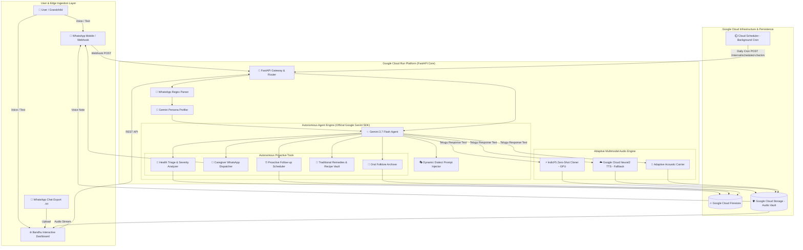

# 🏗️ Bandhu System Architecture

**Bandhu (బంధు / बंधु)** is a cloud-native, autonomous multimodal agent platform built on **Google Gemini 3.7 Flash**, **Google Cloud Firestore**, **Google Cloud Run**, and an **Adaptive Dual-Engine Speech Synthesizer**.

---

## 1. High-Level Architecture Diagram



---

## 2. Component Breakdown

### A. Persona Ingestion & Personality Cloning
- **WhatsApp Chat Parser**: Regex engine parsing both iOS (`[dd/mm/yy, hh:mm:ss] Name: Msg`) and Android (`dd/mm/yyyy, hh:mm - Name: Msg`) export files.
- **Gemini Persona Profiler**: Uses Gemini 3.7 Flash to distill vocabulary, regional catchphrases (`బా`, `జేస్తిని`), terms of endearment (`కన్నా`, `తల్లీ`, `నాయనా`), and maternal care habits into a structured `PersonaProfile`.

### B. Autonomous Agent Core (`google-genai` SDK)
- **Model**: `gemini-3.7-flash` for sub-second conversational latency and typed Function Calling.
- **Dynamic System Prompt**: Injects custom relationship dynamics, dialect rules, and memory context on the fly.
- **Tool Dispatcher**: Executes clinical triage severity evaluation (`LOW`, `MEDIUM`, `CRITICAL`), registers proactive check-ins, and formats caregiver alerts.

### C. State & Persistence (Google Cloud Firestore)
- Collections:
  - `bandhu_personas`: Ingested persona profiles and dialect configurations.
  - `bandhu_memories`: Long-term contextual memory items.
  - `bandhu_health_logs`: Daily wellbeing and vital signs history.
  - `bandhu_emergency_alerts`: High-priority caregiver dispatch records.
  - `bandhu_oral_histories`: Spoken family folklore and traditional recipes.

### D. Adaptive Multimodal Voice Synthesis
- **Primary Tier**: GPU-accelerated **IndicF5 Zero-Shot Neural Cloner** for authentic Telugu voice cloning.
- **Cloud Fallback Tier**: **Google Cloud Text-to-Speech** (`te-IN-Standard-A` / Neural2) for zero-crash execution on standard Cloud Run containers.
- **Acoustic Fallback Tier**: Synthetic pitch-matched harmonics generator for offline local testing.

### E. Speaker Timbre Indices (FAISS)
- `data/pappa_voice.index`: **1,742** HuBERT timbre vectors (768-dim, `IndexFlatIP`).
- `data/grandma_voice.index`: **24,177** HuBERT timbre vectors (768-dim, `IndexFlatIP`).

---

## 3. Autonomous Scheduled Check-In Path

- **Trigger**: Google **Cloud Scheduler** job fires a daily `POST /internal/scheduled-checkin` — no user request, no request body.
- **Execution**: The route invokes the existing `BandhuGeminiAgent` with a hardcoded system trigger (`proactive morning check-in`) for the `pappa` or `grandma` persona.
- **Persistence**: The generated check-in text is written to the existing Firestore `bandhu_memories` collection via `MemoryStore`.
- **Observability**: A timestamped line is logged to stdout (`[SCHEDULED-CHECKIN] ... initiator=cloud-scheduler user_request=none`) proving the turn was agent-initiated.

### Wiring the Cloud Scheduler job (run manually once)

```bash
# 1. Service account that Scheduler uses to call Cloud Run with an OIDC token
gcloud iam service-accounts create bandhu-scheduler \
  --project "$GCP_PROJECT_ID" \
  --display-name "Bandhu Cloud Scheduler invoker"

gcloud run services add-iam-policy-binding bandhu-agent \
  --project "$GCP_PROJECT_ID" \
  --region us-central1 \
  --member "serviceAccount:bandhu-scheduler@$GCP_PROJECT_ID.iam.gserviceaccount.com" \
  --role roles/run.invoker

# 2. Daily 08:00 IST proactive check-in (no request body)
gcloud scheduler jobs create http bandhu-daily-checkin \
  --project "$GCP_PROJECT_ID" \
  --location us-central1 \
  --schedule "0 8 * * *" \
  --time-zone "Asia/Kolkata" \
  --http-method POST \
  --uri "https://bandhu-agent-757381556163.us-central1.run.app/internal/scheduled-checkin?persona=pappa" \
  --oidc-service-account-email "bandhu-scheduler@$GCP_PROJECT_ID.iam.gserviceaccount.com" \
  --oidc-token-audience "https://bandhu-agent-757381556163.us-central1.run.app" \
  --attempt-deadline 120s

# 3. Manual smoke test
gcloud scheduler jobs run bandhu-daily-checkin \
  --project "$GCP_PROJECT_ID" --location us-central1
```

> **Access control**: `/internal/scheduled-checkin` performs no authentication of its own. It is only safe if the Cloud Run service requires authenticated invocations (i.e. deployed *without* `--allow-unauthenticated`, with the Scheduler service account granted `roles/run.invoker` as above). If the service is currently public, this route is publicly triggerable and should be protected before the demo.
