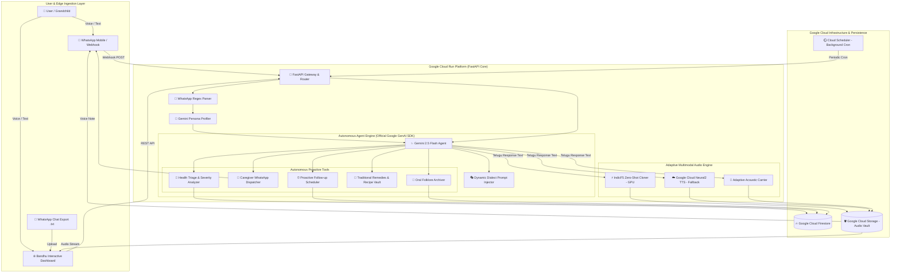

# 🏗️ Bandhu System Architecture

**Bandhu (బంధు / बंधु)** is a cloud-native, autonomous multimodal agent platform built on **Google Gemini 2.5 Flash**, **Google Cloud Firestore**, **Google Cloud Run**, and an **Adaptive Dual-Engine Speech Synthesizer**.

---

## 1. High-Level Architecture Diagram

---

## 2. Component Breakdown

### A. Persona Ingestion & Personality Cloning
- **WhatsApp Chat Parser**: Regex engine parsing both iOS (`[dd/mm/yy, hh:mm:ss] Name: Msg`) and Android (`dd/mm/yyyy, hh:mm - Name: Msg`) export files.
- **Gemini Persona Profiler**: Uses Gemini 2.5 Flash to distill vocabulary, regional catchphrases (`బా`, `జేస్తిని`), terms of endearment (`కన్నా`, `తల్లీ`, `నాయనా`), and maternal care habits into a structured `PersonaProfile`.

### B. Autonomous Agent Core (`google-genai` SDK)
- **Model**: `gemini-3.6-flash` for sub-second conversational latency and typed Function Calling.
- **Dynamic System Prompt**: Injects custom relationship dynamics, dialect rules, and memory context on the fly.
- **Tool Dispatcher**: Executes clinical triage severity evaluation (`LOW`, `MEDIUM`, `CRITICAL`), registers proactive check-ins, and formats caregiver alerts.

### C. State & Persistence (Google Cloud Firestore)
- Collections:
  - `bandhu_personas`: Ingested persona profiles and dialect configurations.
  - `bandhu_memories`: Long-term contextual memory items.
  - `bandhu_health_logs`: Daily wellbeing and vital signs history.
  - `bandhu_emergency_alerts`: High-priority caregiver dispatch records.
  - `bandhu_oral_histories`: Spoken family folklore and traditional recipes.

### D. Adaptive Multimodal Voice Synthesis
- **Primary Tier**: GPU-accelerated **IndicF5 Zero-Shot Neural Cloner** for authentic Telugu voice cloning.
- **Cloud Fallback Tier**: **Google Cloud Text-to-Speech** (`te-IN-Standard-A` / Neural2) for zero-crash execution on standard Cloud Run containers.
- **Acoustic Fallback Tier**: Synthetic pitch-matched harmonics generator for offline local testing.
