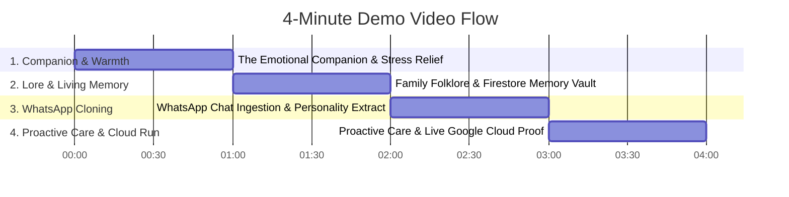

# 🎬 Bandhu (బంధు) — 4-Minute Hackathon Demo Video Script

> **Video Duration**: Strictly 4:00 (or under)  
> **Key Tone**: Warm, human, empathetic, technologically rigorous, Google Cloud native.

---

## ⏱️ Minute-by-Minute Blueprint

---

### Minute 0:00 – 1:00: The Empathetic Companion & Support Friend
- **Visual**: Open `http://localhost:8080` (or your live Cloud Run URL).
- **Narration**:  
  > *"This is Bandhu (బంధు), meaning 'Loved One and Faithful Companion'. Millions of us live far away from the elders and friends who ground us most. Standard AI chatbots are cold and robotic. Bandhu brings back the authentic voice, humor, and emotional warmth of your loved ones."*
- **Action**: Click the mic or type in Telugu:  
  `"అమ్మమ్మ, ఈరోజు ఆఫీసులో చాలా అలసిపోయాను బా, చాలా ఒత్తిడిగా ఉంది"` (*Grandma, I'm so exhausted from office today, feeling very stressed*).
- **Audio Output**: Play Grandma's cloned voice:  
  > *"అయ్యో నాయనా! కష్టపడి పని చేసి బాగా అలసిపోతివా? ఏం బాధపడకు బా, కాసేపు హాయిగా పండుకో. నేను నీకు ఇష్టమైన రాగి ముద్ద జేస్తాలే స్వామి."*
- **Highlight**: Emphasize the emotional comfort, regional Chittoor dialect (`బా`, `జేస్తాలే`, `స్వామి`), and warm maternal tone.

---

### Minute 1:00 – 2:00: Living Memory & Cultural Folklore Vault
- **Visual**: Show the **Cultural Knowledge Vault** on the right panel.
- **Narration**:  
  > *"Bandhu isn't just an interface; it's a living oral history archive. It preserves traditional recipes, idioms, and childhood memories permanently in Google Cloud Firestore."*
- **Action**: Type:  
  `"అమ్మమ్మ మన ఇంట్లో మిరియాల కషాయం ఎలా చేస్తావో చెప్పు"` (*Grandma, tell me how you make our family Pepper Kashayam*).
- **Highlight**: Gemini executes `lookup_cultural_remedy` tool and recalls authentic ingredients and instructions.

---

### Minute 2:00 – 3:00: Universal WhatsApp Chat Ingestion & Personality Cloning
- **Visual**: Focus on the **WhatsApp Chat Ingestion** drop zone on the left panel.
- **Narration**:  
  > *"Anyone can clone the personality of their loved one in seconds by exporting their WhatsApp chat."*
- **Action**: Click **"Load Sample Grandma Chat"** (or upload your exported `.txt`).
- **Highlight**: Show Gemini 3.7 Flash parsing turns, extracting catchphrases (`బా`, `తింటివా`), pet names (`కన్నా`, `నాయనా`), and maternal care directives into a structured `PersonaProfile`.

---

### Minute 3:00 – 4:00: Proactive Care Safety Net & Google Cloud Architecture
- **Visual**: Switch to health check & Google Cloud Console.
- **Action**: Type:  
  `"అమ్మమ్మ నాకు ఒంట్లో బాగోలేదు, జ్వరం, తలనొప్పిగా ఉంది"` (*Grandma, I'm feeling sick with fever and headache*).
- **Highlight**:
  - Show the `⚡ tool: analyze_and_dispatch_health_alert` execution.
  - Show the live **Caregiver Escalation** tile popping up with simulated emergency WhatsApp dispatch.
- **Show Google Cloud Proof (Final 30s)**:
  - Tab 1: **Google Cloud Run** showing `bandhu-agent` healthy and serving 100% traffic.
  - Tab 2: **Google Cloud Firestore** showing the `bandhu_personas`, `bandhu_memories`, and `bandhu_health_logs` collections.
- **Closing Statement**:  
  > *"Bandhu preserves human connection and cultural heritage across generations—powered by Gemini and Google Cloud."*
